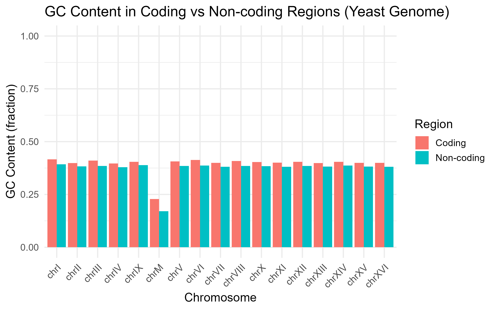
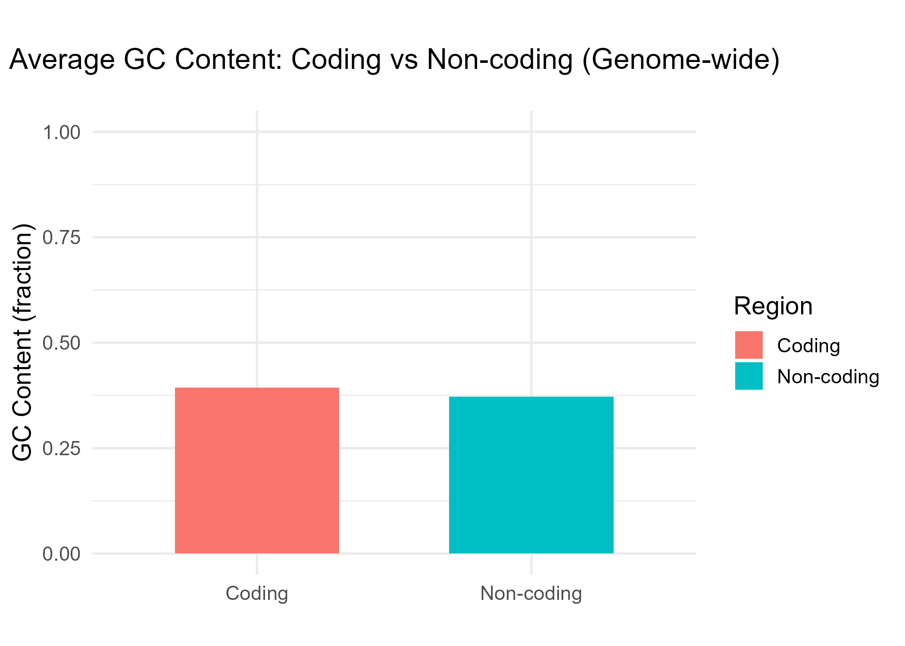
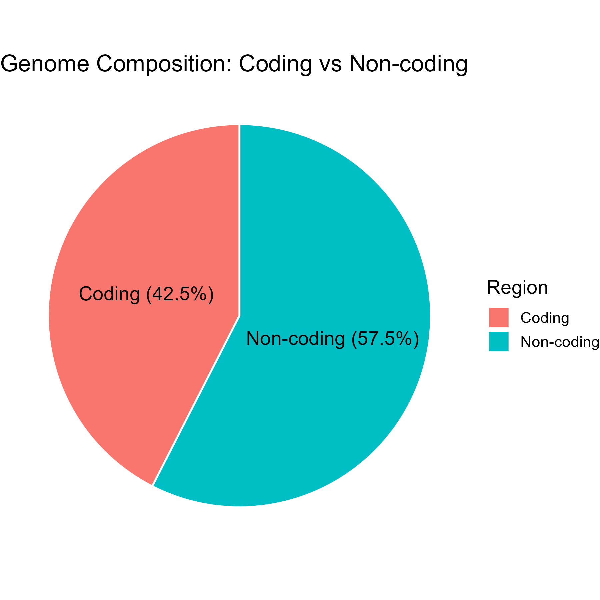

# 🧬 Yeast Genome Analysis

This repository contains a **comprehensive analysis of the *Saccharomyces cerevisiae* (yeast) genome**, focusing on **coding vs non-coding regions** and **GC content**.  
The project uses **R and Bioconductor** packages to extract genomic annotations, compute base composition per chromosome, and visualize genome-wide patterns.

---

## 🚀 Features
- Extract coding vs non-coding sequences per chromosome.
- Compute GC content for both regions.
- Save results as CSV and PNG plots.
- Visualize:
  - GC content per chromosome
  - Average genome-wide GC content
  - Genome composition pie chart

---

## 📂 Output Files
Place all output files in the `results/` folder:

- `yeast_coding_vs_noncoding_all_chr.csv`  
- `GCcontent_per_chromosome.png`  
- `GCcontent_genomewide.png`  
- `genome_composition_pie.png`  

---

## 📊 Example Results

---

## 🧾 Analysis and Interpretation

### GC Content Distribution Across Coding and Non-coding Regions
- The Coding regions show consistently higher GC content (~0.40) than non-coding (~0.38). 
- Mitochondrial DNA (chromosome M) displays much lower GC content (<0.25), reflecting its distinct evolutionary origin.
- Higher GC in coding sequences suggests greater DNA stability, codon usage optimization, and efficient transcription.
  
### Genome-wide Average GC Content
- Coding: ~40%
- Non-coding: ~38%
- Even small GC differences are biologically significant, influencing gene structure, transcriptional activity, and genome evolution.
  
### Genome Composition
- Coding sequences are the approximately 42.5% of the genome 
- Non-coding sequences are the almost 57.5% of the genome 

---

## 🔬 Biological Insights
- Higher GC in coding DNA → stable, efficient transcription.  
- Non-coding DNA → regulatory flexibility, genome evolution.  
- Mitochondrial genome → distinct evolutionary path.

---

## ✅ Conclusion
This analysis highlights how nucleotide composition varies by genomic region, influencing gene expression, genome stability, and evolution in *Saccharomyces cerevisiae*.

---

## 👨‍💻 Author
Md Abrar Faiyaj  
PostGraduate Biotechnology Student | Aspiring Ph.D. Researcher | Bioinformatics Enthusiast

---

## 🔗 GitHub
[https://github.com/mdabrarfaiyaj/yeast-genome-analysis](https://github.com/mdabrarfaiyaj/yeast-genome-analysis)
